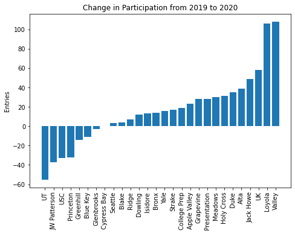
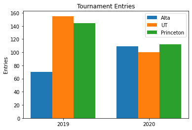
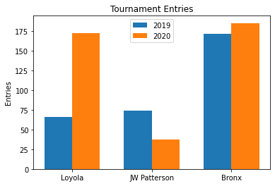
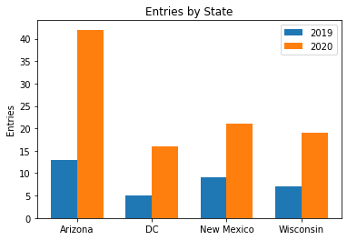
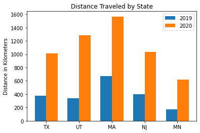
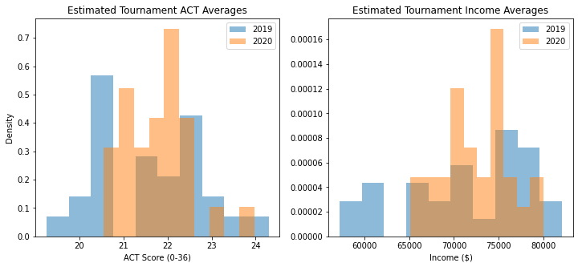
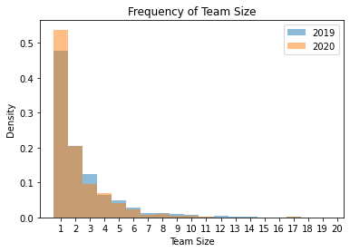

# Five Trends Among E-Debate Competitors

By Peter Zhang

#### Introduction

Tournaments this season have, so far, been held exclusively online. While judging debate rounds certainly feels different through a Zoom window, virtual platforms could also affect who chooses to sign up for tournaments.

Plenty of factors could be relevant in the transition. One is that location no longer matters: you can compete at someone's tournament whether you're in the same county or across the country. At the same time, the format could reward debaters with better Wi-Fi connections and mics. Many other factors, like the economic hardship imposed by the pandemic or decreased support from schools, may also alter the face of the competition.

So, who are the e-debaters? This article takes a look at five trends in the data.

#### Dataset

I considered every tournament held from September to December of 2020 with a bid in LD, as well as their 2019 counterparts. After excluding tournaments that didn't post entries (Scarvite) or weren't hosted in 2019 (Delores), the dataset included 27 tournaments[^1]. For each of the remaining tournaments, I scraped information on Varsity LD competitors off the Tabroom entries page. Entries that lacked a location were omitted from the geographic analysis. The full dataset of entries is available [here](https://github.com/petezh/Disclosure/blob/master/tab_data/edebate_entries.csv).

#### Analysis

**Trend #1: There are fewer debaters, but they compete more frequently.**

A first glance at the data highlighted big shifts over the last year. Among them:

- 1312 debaters competed in an average of about 2 tournaments in 2019; 1103 debaters averaged 2.77 tournaments each in 2020.
- The total number of entries increased by 17.5% from 2019 to 2020. 
- Tournaments gained an average of 18 competitors this year.

The decrease in distinct debaters shouldn't be surprising. Teams could've had a tough time recruiting new debaters. Debaters themselves might have had other priorities in their lives. And, competitors who enjoyed the social aspects of debate may have felt that tournaments were no longer worth it. 

The bump in entries is also predictable. With fewer logistical barriers, avid debaters could've had greater access to tournaments. Moreover, many tournaments usually held early in the year were postponed (e.g. St. Marks, Notre Dame), which might have concentrated interest in remaining, available tournaments.

**Trend #2: Tournament pools are shaped by competitive incentives, a function of bids offered and concurrent tournaments.**

The increase in entries wasn't uniform across all tournaments. Twenty tournaments got more popular, but the entry pools of seven unlucky hosts either shrunk or stagnated. The differences are drastic. The size of Valley's entry pool doubled (from 93 to 201) while JW Patterson's pool was halved (from 74 to 37).

Competitive incentives can explain the difference, and the trio of Alta, UT, and Princeton offers an insightful example. The three semis bid tournaments were held on the same weekend in both 2019 and 2020. This year, UT and Princeton lost a third of their entries; Alta's pool *increased* by nearly half. That's interesting enough, but let's take a look at the pools this year: UT had 100 entries, Alta had 109, and Princeton, 112—roughly equal. This equilibrium is exactly what we'd expect if, in the absence of geographic barriers, debaters just followed the bids.

Two other case studies stand out. The first is Loyola, a *quarters* bid: it tripled the size of its pool from 66 to 172. Baffling on face, but reasonable in light of the fact that no other tournaments were scheduled for that weekend—debaters didn't have a choice.

The second is JW Patterson and Bronx. What caused JW's entry pool to collapse? The answer, it seems, is that debaters abandoned JW (a finals bid) to compete at Bronx (an octas bid), which offered fourteen more bids. Sure enough, Bronx picked up fourteen more competitors this year. After factoring bidding opportunity, the 37 to 185 disparity seems a lot more reasonable (maybe even too small!).

**Trend #3: While dominant states began debating across the county, smaller states have also ramped up participation.**

Of course, in many states, circuit LD has little to no presence—for most, this year hasn't changed that. This list includes Delaware, Kansas, Montana, Tennessee, Vermont, and Maine. But, some of them saw their first competitors this year: we can welcome competitors South Carolina, West Virginia, Hawaii, and Michigan to circuit LD.

Across the board, smaller states grew their presence. Just take a look at Arizona, DC, New Mexico, or Wisconsin. On average, states like these—with fewer than 20 competitors in 2019—doubled the number of entries in 2020.

Among larger states, the biggest winner by far was California, where entries skyrocketed from 528 to 840 (that increase is, by necessity, omitted from the map below). New Jersey, New York, North Carolina, and Texas were stable, while Florida, Iowa, Massachusetts, Minnesota, Pennsylvania, and Washington saw moderate increases. Meanwhile, states like Alabama, Illinois, Louisiana, Nebraska, and Virginia—many in Southeast—saw fairly large declines in participation.

But are these increases actually driven by debaters competing at faraway tournaments? As it turns out, yes.

I estimated the location of a given tournament or competitor from the [geographic centroid](https://developers.google.com/public-data/docs/canonical/states_csv) of their state. With two sets of coordinates, I computed the distance[^2] between a tournament and each of their competitors. It isn't very accurate, but it should certainly reveal if, for example, more West Coast debaters are competing on the East Coast.

The average competitor traveled about 350 miles to tournaments in 2019; this year, the average competitor was 700 miles away from their host. Debaters from Texas, Utah, Nevada, New Jersey, Minnesota made the biggest leaps in distance, which makes sense: states that could usually count on great local tournaments have chosen to explore.

On the other hand, the tournaments with the biggest increases in distance were UT, College Prep, Duke, Grapevine, Heritage, Jack Howe, Loyola, and Seattle. Tournaments that are usually attended by locals and a handful of travelers have gone national. This parallels the increase in the number of states represented at tournaments: in 2019, the average tournament hosted competitors from 9.37 states—that number is now 17.07.

**Trend #4: While cross-tournament differences have tightened, e-debate seems to slightly favor well-off states.**

While competitor pools have become more geographically diverse, I suspected that they also have become more privileged. I took the median [real household income](https://fred.stlouisfed.org/release/tables?rid=249&eid=259515) for each state and used it as a benchmark for wealth. I also took the median [ACT scores](https://www.statista.com/statistics/305987/us-average-act-scores-by-state/) of each state as a proxy for the quality of education. As you might expect, states on both coasts tended to measure the highest on these metrics.

I looked at how average income and ACT scores changed for the tournaments. The geographic trends drove most of the change across these metrics, tightening the spread of ACT scores and household incomes. If a tournament mostly drew competitors from well-off states in 2019, then more competitors from less privileged states competed in 2020, and vice versa.

Nonetheless, the weighted average shifted upward for both metrics. The average median household income increased by $811 from 2019 to 2020; the average ACT score rose by 0.079. I conducted a two sample pooled z-test the ACTs and incomes of the 2019 and 2020 entries. The increase in ACTs scores was somewhat significant (p = 0.0465) while the increase in income was highly significant (p = 0.000546).

These increases aren't large, but overall, wealthier and better-educated states are sending more debaters to tournaments. All of this makes sense if we keep in mind which states grew the most over the shift: states like California, Massachusetts, and Washington.

**Trend #5: More lone wolves and smaller teams are competing.**

Finally, I took a look at the teams which sign up for tournaments. In 2019, 19.9% of entries signed up as the only competitor from their school. This year, that proportion has risen to 25.3%. In fact, the size of squads seems to be generally declining. The average team size in 2019 was 2.96, while the average team  in 2020 had 2.79 members.

Plenty of factors could explain the trend: lone wolves might find it easier to sign up, there's probably less need for teammates, and some tournaments have doubled down on entry caps. Regardless, this year seems to be more welcoming to smaller squads.

#### Conclusion

Based on results from tournaments this year, overall participation seems to be weathering the virtual environment—with some caveats. While competitors are more geographically diverse, the increase in entries might be skewed towards wealthier states. At the same time, more smaller teams are competing, and teams everywhere are signing up for tournaments based on bid potential.

You can argue about whether these changes are net good or bad — I won't make a case for either. But, with the [TOC](https://www.tabroom.com/index/tourn/index.mhtml?tourn_id=16714) slated to be held virtually, e-debate seems to be here to stay, at least for the rest of the season. And that means that questions about who is debating, and how they are affected by the online format, are important to consider.

There were several limitations to this analysis:

- I omitted tournaments that were held in the fall of 2019 that were postponed this year, which likely underestimated participation in 2019.
- Some entries either omitted or falsified information (why, Princeton, did you say you were from Maine?). I rooted out some obvious errors, but a more detailed review could be helpful.
- Estimates for location wealth, and education were all based on state-level data.
- The z-test assumes that samples are normal. While both samples seem to be bell-shaped, normality tests decisively show that they are not normally distributed.
- The pooled z-test assumes two independent samples. In reality, the 2019 and 2020 samples are likely to be fairly correlated, which means the standard error may be an overestimation. As a result, the p-values are probably conservative.

Avenues for future analysis include:

- Extending the analysis across multiple years and different events
- Incorporating more granular data, perhaps drawing on testing/income stats on the school level
- Studying judge pools—are they similarly diversifying?
- Cross-referencing the wiki to infer changes in argument style

For anyone interested, the code behind the project is open-sourced [here](https://github.com/petezh/E-Debate). A big thanks to Raul Larsen for maintaining his very helpful [TOC Calendar](https://docs.google.com/spreadsheets/d/1liUmwmpt5ku-urlXx_v4OkzIDOcNTaxviAmtG0XUDhg). Thanks as well to Alan George, Aimun Khan, and Joanne Park for their helpful edits and suggestions.

[^1]: The full list of tournaments includes: Alta, Apple Valley, Blake, Blue Key, Bronx, College Prep, Cypress, Dowling, Duke, Glenbrooks, Grapevine, Greenhill, JW Patterson, Holy Cross, Isidore, Meadows, Nano Nagle (Voices), Princeton, Ridge, Seattle, Strake, UK, UT, Valley, Yale.
[^2]: I calculate the distance between two latitude and longitude pairs using Haversine Distance. You can more about that [here](https://www.movable-type.co.uk/scripts/latlong.html).